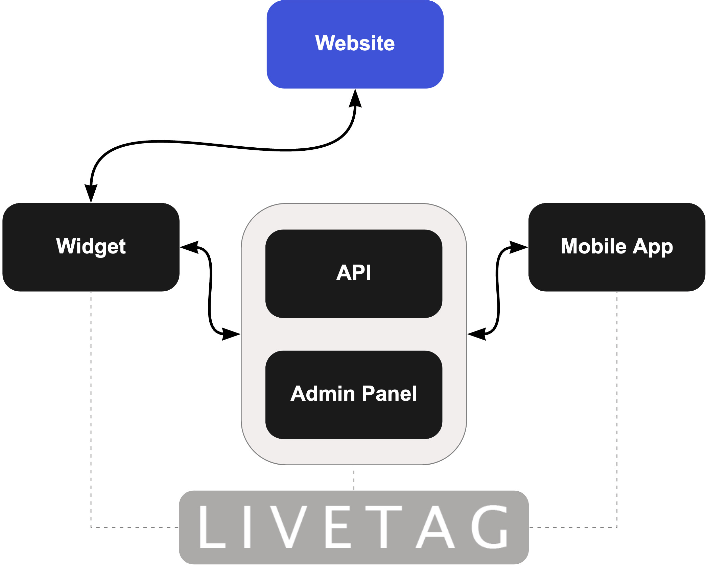

# Introduction

Welcome to LiveTag Video Streaming Documentation.

## What is LiveTag?

    

With Live stream shopping estimated to account for over 20% of China’s online shopping in, brands need to adapt and turn their live stream video into shoppable interactive experiences.
* Check out of our add-to-cart function which can boost the conversion rates on live show by 30%.  
* Stream whenever and wherever to your audience.
* Livetag is versatile and easy to use.
* Plus - it has a sexy interface that leads to high conversion rates.
* To boost your online sales, contact us for a demo [info@livetag.sg](mailto:info@livetag.sg) today.

Here you can find all the information about how to use LiveTag as an online-shopping solution.

## How can I start

1. Contact LiveTag [info@livetag.sg](mailto:info@livetag.sg).
2. Integrate the widget using this step-by-step instruction.
3. Authorize the Admin Panel and add products you want to show.
4. Download the Streaming App (for your iOS or Android device)
5. Authorize and get in touch with your audience by running a livestream to show all the benefits of your products.
6. End livestream whenever you want.
7. Check statistics on the livestream.

See [presentation](https://docs.google.com/presentation/d/1264aBJpSVf6-YZspPkmXR4Wb9T0E1vDlISA8QyQHDhc).
